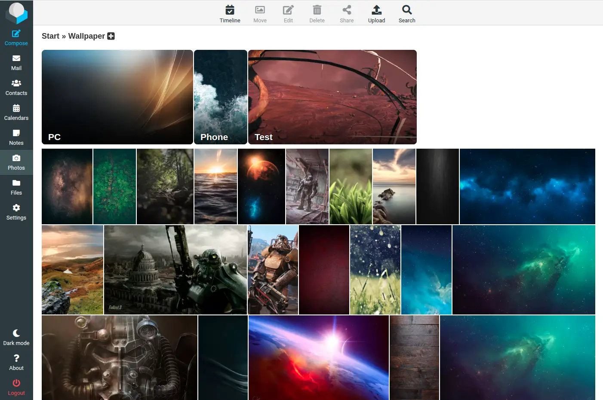

# Roundcube Photos
This is a photos/gallery plugin for Roundcube, similar to Google Photos/Amazon Photos. You can view your personal photos that are synced to your personal storage in a easy way. This plugin does not sync itself, it gives you only easy access to the synced photos. To sync your photos, you can use any software/system which can automatically sync the photos from your smartphone (or any other device) to a storage accessible by Roundcube. 

I used [Justified-Gallery](https://github.com/miromannino/Justified-Gallery) to show the thumbnails on the page in a way i personally like it and [GLightbox](https://biati-digital.github.io/glightbox/) to display the photod. Videos are integrated via [Plyr](https://github.com/sampotts/plyr). Please see the license details on the page of this projects.

# Contribution
If you would like to support this Plugin, you have various options. You can report bugs via the [Issue Tracker](https://codeberg.org/Offerel/Roundcube_Pictures/issues). This helps me to fix these bugs as quickly as possible.

Another option is to help translate the plugin into other languages. This is relatively easy to do via Weblate. The following languages are currently available:

# Issues
Please create issues in the [Codeberg.org](https://codeberg.org/Offerel/roundcube_pictures/issues) issue tracker. I have disabled the issue tracker in GitHub.com because the repo there is only used as a workaround and for compatibility reasons.

# Installation
Please see the installation steps in the [Wiki](../../../../../Offerel/roundcube_pictures/wiki/#installation).

# FAQ
I have created a [FAQ](../../../../../Offerel/roundcube_pictures/wiki/#faq) with most frequently asked questions in the Wiki
